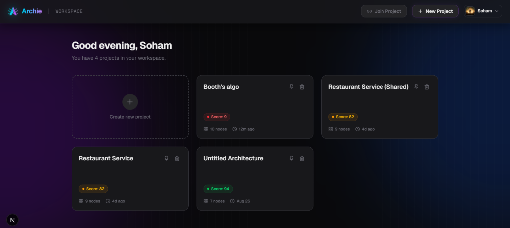
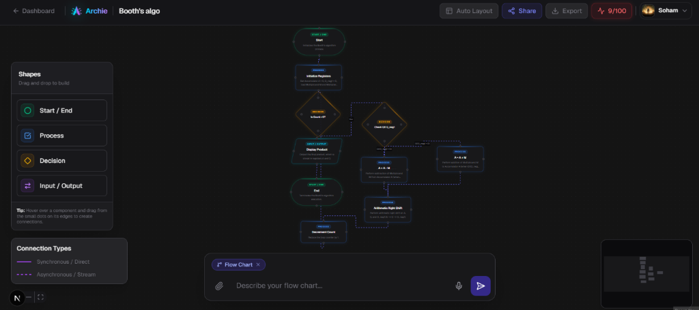

<div align="center">
  
</div>

<h1 align="center">Archie — The AI Architecture Studio</h1>

<p align="center">
  <strong>Intelligently design, evaluate, and manage system architectures using the power of AI.</strong>
</p>

<p align="center">
  <a href="#features">Features</a> •
  <a href="#tech-stack">Tech Stack</a> •
  <a href="#getting-started">Getting Started</a> •
  <a href="#screenshots">Screenshots</a>
</p>

---

## 🚀 Overview

**Archie** is an advanced, AI-powered system architecture design tool that allows engineers and architects to build, auto-layout, and evaluate complex system diagrams instantly. By simply describing your flow chart or system requirements, Archie generates a node-based architecture, scores its efficiency, and provides an interactive canvas to refine the design.

## ✨ Features

- **🧠 AI-Powered Diagram Generation**: Describe your system architecture in plain text, and let Archie's AI automatically construct the flow chart.
- **📊 Real-Time Scoring System**: Each architecture is evaluated and scored out of 100 based on efficiency, scalability, and best practices.
- **📁 Advanced Workspace Management**: Organize your projects with custom-colored folders, pin your most important architectures, and search across your entire workspace effortlessly.
- **🎨 Interactive Node Editor**: Drag-and-drop canvas powered by React Flow with custom shapes (Process, Decision, I/O) and connection types (Synchronous, Asynchronous).
- **🪄 Auto-Layout**: Instantly organize chaotic diagrams into clean, symmetrical layouts with a single click.
- **🔒 Secure Authentication**: Robust user authentication and session management handled via Supabase.
- **🌗 Stunning UI/UX**: A highly polished, dark-mode native interface featuring smooth `framer-motion` animations, glassmorphism, and a premium aesthetic.

## 🛠️ Tech Stack

Archie is built using a modern, scalable web stack:

- **Framework**: [Next.js 14](https://nextjs.org/) (App Router, Server Actions)
- **Database & Auth**: [Supabase](https://supabase.com/) (PostgreSQL)
- **Styling**: [Tailwind CSS v4](https://tailwindcss.com/)
- **Animations**: [Framer Motion](https://www.framer.com/motion/)
- **Canvas / Diagramming**: [React Flow](https://reactflow.dev/)
- **Icons**: [Lucide React](https://lucide.dev/)

## 📸 Screenshots

### The Workspace Dashboard
Organize your projects efficiently with folders, pinning, and real-time search.
<div align="center">
  
</div>

### The AI Architecture Editor
Design systems manually or describe them to the AI to generate complex flow charts instantly.
<div align="center">
  
</div>

## 🏁 Getting Started

### Prerequisites
- Node.js 18.x or later
- A Supabase account and project

### Installation

1. **Clone the repository**
   ```bash
   git clone https://github.com/walshdsouza/Archie.git
   cd Archie
   ```

2. **Install dependencies**
   ```bash
   npm install
   ```

3. **Set up environment variables**
   Create a `.env.local` file in the root directory and add your Supabase credentials:
   ```env
   NEXT_PUBLIC_SUPABASE_URL=your_supabase_url
   NEXT_PUBLIC_SUPABASE_ANON_KEY=your_supabase_anon_key
   ```

4. **Run the development server**
   ```bash
   npm run dev
   ```

5. **Open the app**
   Visit [http://localhost:3000](http://localhost:3000) in your browser.

---

<div align="center">
  Built with ❤️ for Software Architects.
</div>
